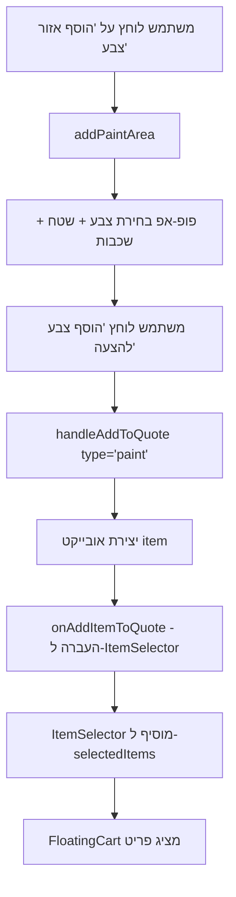
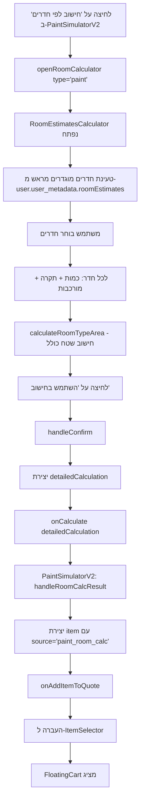
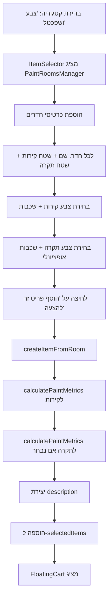
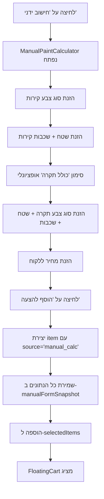

# תיעוד מלא - זרימת קטגוריית צבע ושפכטל

> **תאריך יצירה**: 2025-11-15
> **מטרה**: תיעוד מפורט של כל הזרימות, הקבצים והמסלולים בקטגוריית הצבע/שפכטל

---

## 📋 תוכן עניינים

1. [סקירה כללית](#סקירה-כללית)
2. [קבצים עיקריים](#קבצים-עיקריים)
3. [זרימה #1: חישוב פשוט (PaintSimulatorV2)](#זרימה-1-חישוב-פשוט-paintsimulatorv2)
4. [זרימה #2: חישוב מתקדם לפי חדרים (RoomEstimatesCalculator)](#זרימה-2-חישוב-מתקדם-לפי-חדרים-roomestimatescalculator)
5. [זרימה #3: חישוב מתקדם עם PaintRoomsManager](#זרימה-3-חישוב-מתקדם-עם-paintroomsmanager)
6. [זרימה #4: חישוב ידני (Manual Calculator)](#זרימה-4-חישוב-ידני-manual-calculator)
7. [תצוגה בעגלה (FloatingCart)](#תצוגה-בעגלה-floatingcart)
8. [שמירה והעלאה מ-Database](#שמירה-והעלאה-מ-database)
9. [בעיות ידועות ופתרונות](#בעיות-ידועות-ופתרונות)

---

## 🎯 סקירה כללית

המערכת מספקת **4 מסלולים שונים** להוספת פריטי צבע/שפכטל להצעת מחיר:

1. **חישוב פשוט** - הזנת שטח, בחירת צבע ומספר שכבות
2. **חישוב מתקדם לפי חדרים** - בחירת סוגי חדרים עם שטחים מוגדרים מראש
3. **חישוב מתקדם עם כרטיסי חדרים** - מנהל חדרים מורכב עם צבע נפרד לקירות/תקרה
4. **חישוב ידני** - הזנה ידנית של כל הפרמטרים

---

## 📁 קבצים עיקריים

### Frontend Components

| קובץ | מיקום | תפקיד |
|------|-------|-------|
| `ItemSelector.jsx` | `Frontend/src/components/quotes/QuoteBuilder/` | קומפוננטה ראשית - מכילה `PaintRoomsManager` מוטמע |
| `PaintSimulatorV2.jsx` | `Frontend/src/components/quotes/QuoteBuilder/` | חישוב פשוט - בחירת צבע/שפכטל + שטח + שכבות |
| `RoomEstimatesCalculator.jsx` | `Frontend/src/components/quotes/QuoteBuilder/` | חישוב מתקדם לפי חדרים מוגדרים מראש |
| `FloatingCart.jsx` | `Frontend/src/components/quotes/QuoteBuilder/` | תצוגת העגלה - מציג פריטים לפי `source` |
| `PaintPriceCalculator.jsx` | `Frontend/src/components/quotes/QuoteBuilder/` | מחשבון עלויות ומחירים (UI בלבד) |
| `PaintSimulator.jsx` | `Frontend/src/components/quotes/QuoteBuilder/` | **ישן** - לא בשימוש |
| ~~`PaintRoomsManager.jsx`~~ | ~~`Frontend/src/components/quotes/QuoteBuilder/`~~ | **נמחק** - קוד כפול שלא היה בשימוש |

### Utilities & Services

| קובץ | מיקום | תפקיד |
|------|-------|-------|
| `paintCalculations.js` | `Frontend/src/components/quotes/QuoteBuilder/utils/` | פונקציות חישוב: `calculateExactPaintMetrics` |
| `entities/index.js` | `Frontend/src/lib/entities/` | המרות DB: `convertKeysToCamelCase`, `convertKeysToSnakeCase` |

---

## 🔄 זרימה #1: חישוב פשוט (PaintSimulatorV2)

### תיאור
המשתמש בוחר צבע/שפכטל, מזין שטח ומספר שכבות, והמערכת יוצרת פריט בעגלה.

### קובץ מקור
`PaintSimulatorV2.jsx` (שורות 12-406)

### זרימת קוד



### קוד מפתח

#### 1. הוספת אזור צבע (שורה 44)
```javascript
const addPaintArea = () => {
  setPaintAreas([...paintAreas, {
    id: Date.now(),
    item: null,
    area: '',
    layers: 1
  }]);
};
```

#### 2. הוספה לעגלה (שורות 68-135)
```javascript
const handleAddToQuote = (type) => {
  const areas = type === 'paint' ? paintAreas : plasterAreas;

  areas.forEach(area => {
    if (area.item && area.area > 0) {
      const item = {
        id: `${type}_${area.id}_${Date.now()}`,
        categoryId: 'cat_paint_plaster',
        categoryName: 'צבע ושפכטל',
        source: `${type}_simulator`,  // ⭐ זה ה-source המזהה!
        description: `${area.item.itemName} - ${areaValue} מ"ר`,
        quantity: areaValue,
        unit: 'מ"ר',
        layers: layersValue,
        paintType: type === 'paint' ? area.item.itemName : undefined,
        plasterType: type === 'plaster' ? area.item.itemName : undefined,
        unitPrice: Math.round(baseTotalPrice / areaValue),
        totalPrice: Math.round(baseTotalPrice),
        totalCost: Math.round(baseTotalCost),
        materialCost: materialCost,
        laborCost: laborCost,
        profit: Math.round(profit),
        profitPercent: profitPercent,
        workDuration: workDuration,
        itemData: area.item,
      };

      console.log(`🎨 [PaintSimulatorV2] Adding ${type} item:`, item);
      onAddItemToQuote(item);
    }
  });
};
```

### שדות חשובים ב-item

| שדה | ערך לדוגמה | הערות |
|------|------------|-------|
| `source` | `'paint_simulator'` או `'plaster_simulator'` | **זיהוי הפריט בעגלה** |
| `paintType` | `'סופרקריל מט'` | רק לצבע |
| `plasterType` | `'גבס'` | רק לשפכטל |
| `layers` | `2` | מספר שכבות |
| `quantity` | `50` | שטח במ"ר |
| `totalPrice` | `5000` | מחיר ללקוח |
| `totalCost` | `3000` | עלות קבלן |

### תצוגה בעגלה
`FloatingCart.jsx` שורות 161-210 - `renderSimpleAreaItem()`

```javascript
const renderSimpleAreaItem = (item, onRemoveItem) => {
  const isPaint = item.source === 'paint_simulator';
  const isPlaster = item.source === 'plaster_simulator';

  return (
    <div className="bg-white p-3 rounded-lg shadow-sm border">
      <Paintbrush className={isPaint ? 'text-blue-500' : 'text-orange-500'} />
      <p>{item.description}</p>
      <div>
        <span>סוג: {item.paintType || item.plasterType}</span>
        <span>שכבות: {item.layers}</span>
        <span>שטח: {item.quantity} מ"ר</span>
      </div>
    </div>
  );
};
```

---

## 🏠 זרימה #2: חישוב מתקדם לפי חדרים (RoomEstimatesCalculator)

### תיאור
המשתמש בוחר חדרים מרשימה מוגדרת מראש (חדר שינה, סלון, וכו'), ועבור כל חדר מגדיר:
- כמות (מספר חדרים מאותו סוג)
- האם כולל תקרה
- רמת מורכבות (רגיל/בינוני/מורכב/מורכב מאוד)

המערכת מחשבת שטח אוטומטית לפי חדרים ומכפילה לפי מורכבות.

### קובץ מקור
`RoomEstimatesCalculator.jsx` (שורות 1-952)

### זרימת קוד



### קוד מפתח

#### 1. חדרים מוגדרים מראש (שורות 182-190)
```javascript
const defaultRooms = [
  { id: 'small_bedroom', roomType: 'חדר שינה קטן', wallAreaSqM: 35, ceilingAreaSqM: 10 },
  { id: 'medium_bedroom', roomType: 'חדר שינה בינוני', wallAreaSqM: 40, ceilingAreaSqM: 12 },
  { id: 'large_bedroom', roomType: 'חדר שינה גדול', wallAreaSqM: 45, ceilingAreaSqM: 15 },
  { id: 'small_living_room', roomType: 'סלון קטן', wallAreaSqM: 50, ceilingAreaSqM: 20 },
  { id: 'large_living_room', roomType: 'סלון גדול', wallAreaSqM: 80, ceilingAreaSqM: 30 },
  { id: 'kitchen', roomType: 'מטבח', wallAreaSqM: 25, ceilingAreaSqM: 10 },
  { id: 'bathroom', roomType: 'אמבטיה', wallAreaSqM: 20, ceilingAreaSqM: 5 },
];
```

#### 2. רמות מורכבות (שורות 44-70)
```javascript
const COMPLEXITY_OPTIONS = [
  {
    id: 'standard',
    label: 'רגיל',
    factor: 1.0,
    description: 'חדר רגיל, תקרות סטנדרטיות, גישה טובה'
  },
  {
    id: 'moderate',
    label: 'בינוני',
    factor: 1.15,
    description: 'תקרה גבוהה מעט, מעט פינות, גישה סבירה'
  },
  {
    id: 'complex',
    label: 'מורכב',
    factor: 1.30,
    description: 'תקרה גבוהה, פינות רבות, גישה מוגבלת'
  },
  {
    id: 'very_complex',
    label: 'מורכב מאוד',
    factor: 1.50,
    description: 'תקרה גבוהה מאוד, פרטים רבים, גישה קשה'
  },
];
```

#### 3. חישוב שטח (שורות 199-240)
```javascript
const calculateRoomTypeArea = useCallback(() => {
  let finalTotalWallArea = 0;
  let finalTotalCeilingArea = 0;

  selectedRooms.forEach(selectedRoom => {
    const roomData = roomEstimatesData.find(room => room.id === selectedRoom.id);
    if (roomData) {
      const quantity = selectedRoom.quantity || 1;
      const includeCeiling = selectedRoom.includeCeiling || false;
      const complexityFactor = selectedRoom.difficultyData?.factor || 1.0;

      // חישוב שטח קירות
      let wallArea = roomData.wallAreaSqM * complexityFactor;
      finalTotalWallArea += wallArea * quantity;

      // חישוב שטח תקרה (רק אם נבחר)
      if (includeCeiling && roomData.ceilingAreaSqM) {
        const ceilingContribution = (roomData.ceilingAreaSqM * complexityFactor) * quantity;
        finalTotalCeilingArea += ceilingContribution;
      }
    }
  });

  setTotalWallArea(finalTotalWallArea);
  setTotalCeilingArea(finalTotalCeilingArea);
  setCalculatedArea(finalTotalWallArea + finalTotalCeilingArea);
}, [selectedRooms, roomEstimatesData]);
```

#### 4. יצירת אובייקט detailedCalculation (שורות 392-445)
```javascript
const handleConfirm = () => {
  if (calculatedArea > 0) {
    const itemData = workType === 'paint' ? paintItemData : plasterItemData;
    const pricePerSqM = itemData?.pricePerSqM || itemData?.unitPrice || 0;
    const costPerSqM = itemData?.costPerSqM || itemData?.unitCost || 0;

    const detailedCalculation = {
      totalArea: calculatedArea,
      wallSqM: totalWallArea,
      ceilingSqM: totalCeilingArea,
      detailedRooms: selectedRooms.map(selectedRoom => {
        const roomData = roomEstimatesData.find(room => room.id === selectedRoom.id);
        if (roomData) {
          const quantity = selectedRoom.quantity || 1;
          const complexityFactor = selectedRoom.difficultyData?.factor || 1.0;

          const roomTotalWallArea = roomData.wallAreaSqM * complexityFactor * quantity;
          const roomTotalCeilingArea = selectedRoom.includeCeiling
            ? roomData.ceilingAreaSqM * complexityFactor * quantity
            : 0;
          const roomTotalArea = roomTotalWallArea + roomTotalCeilingArea;

          const roomTotalPrice = roomTotalArea * pricePerSqM;
          const roomTotalCost = roomTotalArea * costPerSqM;

          return {
            id: selectedRoom.id,
            name: roomData.roomType,
            quantity: quantity,
            includeCeiling: selectedRoom.includeCeiling || false,
            difficultyData: selectedRoom.difficultyData,
            wallArea: roomTotalWallArea,
            ceilingArea: roomTotalCeilingArea,
            totalArea: roomTotalArea,
            pricePerSqM: pricePerSqM,
            costPerSqM: costPerSqM,
            totalPrice: Math.round(roomTotalPrice),
            totalCost: Math.round(roomTotalCost),
            profit: Math.round(roomTotalPrice - roomTotalCost)
          };
        }
        return null;
      }).filter(Boolean)
    };

    onCalculate(detailedCalculation);
  }
  onClose();
};
```

#### 5. קליטה ב-PaintSimulatorV2 (שורות 142-184)
```javascript
const handleRoomCalcResult = (result) => {
  const normalizedResult = {
    ...result,
    totalPrice: result.totalPrice || result.totalSellingPrice || 0,
    totalCost: result.totalCost || result.totalContractorCost || 0,
    materialCost: result.materialCost || (result.totalCost || 0) * 0.6,
    laborCost: result.laborCost || (result.totalCost || 0) * 0.4,
    profit: (result.totalPrice || 0) - (result.totalCost || 0),
    quantity: result.quantity || result.totalArea || 0,
    unit: result.unit || 'מ"ר',
    workDuration: result.workDuration || result.totalWorkDays || 0,
  };

  if (currentCalcType === 'paint') {
    const item = {
      id: `paint_room_${Date.now()}`,
      categoryId: 'cat_paint_plaster',
      categoryName: 'צבע ושפכטל',
      source: 'paint_room_calc',  // ⭐ זיהוי!
      description: result.description || 'צבע מחדרים',
      ...normalizedResult
    };
    console.log('🎨 [PaintSimulatorV2] Adding paint room calc item:', item);
    onAddItemToQuote(item);
  }

  setShowRoomCalc(false);
};
```

### שדות חשובים ב-item

| שדה | ערך לדוגמה | הערות |
|------|------------|-------|
| `source` | `'paint_room_calc'` | **זיהוי הפריט בעגלה** |
| `detailedRooms` | `[{name: 'סלון', wallArea: 50, ...}, ...]` | פירוט חדרים |
| `totalArea` | `120` | סה"כ שטח (קירות + תקרות) |
| `wallSqM` | `100` | שטח קירות |
| `ceilingSqM` | `20` | שטח תקרות |

### תצוגה בעגלה
`FloatingCart.jsx` שורות 212-259 - `renderRoomCalcItem()`

```javascript
const renderRoomCalcItem = (item, onRemoveItem) => {
  return (
    <div className="bg-white p-3 rounded-lg shadow-sm border">
      <Paintbrush className="text-blue-500" />
      <p>{item.description}</p>

      {/* פירוט חדרים */}
      {item.rooms && item.rooms.map((room, idx) => (
        <div key={idx}>
          <span>{room.name}</span>
          <span>{room.area} מ"ר</span>
        </div>
      ))}
    </div>
  );
};
```

---

## 🎨 זרימה #3: חישוב מתקדם עם PaintRoomsManager

### תיאור
זהו החישוב המתקדם ביותר - מנהל כרטיסים של חדרים עם:
- בחירת צבע נפרד לקירות ולתקרה
- מספר שכבות שונה לקירות ותקרה
- שטחים עם ניכויים (פתחים)
- תיאור והערות לכל חדר

**חשוב**: `PaintRoomsManager` **מוטמע ישירות ב-`ItemSelector.jsx`** (שורה 1183+) ולא בקובץ נפרד.

### קובץ מקור
`ItemSelector.jsx` - קומפוננטה מוטמעת `PaintRoomsManager` (שורות 1183-1629)

### זרימת קוד



### קוד מפתח

#### 1. הגדרת PaintRoomsManager (שורות 1183-1196)
```javascript
const PaintRoomsManager = React.forwardRef(({
  onAddItem,
  paintItemsAvailable,
  onCalculationComplete
}, ref) => {
  const [rooms, setRooms] = useState([]);
  const [editingRoomId, setEditingRoomId] = useState(null);

  // ... קוד ניהול חדרים
});
```

#### 2. יצירת פריט מחדר (שורות 1475-1672)
```javascript
const createItemFromRoom = useCallback((room) => {
  let totalWallPaintCost = 0;
  let totalWallPaintPrice = 0;
  let totalCeilingPaintCost = 0;
  let totalCeilingPaintPrice = 0;

  // חישוב עלויות קירות
  if (room.wallPaintItem) {
    const wallMetrics = calculatePaintMetrics(
      room.wallArea,
      room.wallPaintLayers || 1,
      room.wallPaintItem,
      false  // roundBuckets
    );
    totalWallPaintCost = wallMetrics.totalCost;
    totalWallPaintPrice = wallMetrics.totalSellingPrice;
  }

  // חישוב עלויות תקרה
  if (room.ceilingPaintItem && room.ceilingArea > 0) {
    const ceilingMetrics = calculatePaintMetrics(
      room.ceilingArea,
      room.ceilingPaintLayers || 1,
      room.ceilingPaintItem,
      false
    );
    totalCeilingPaintCost = ceilingMetrics.totalCost;
    totalCeilingPaintPrice = ceilingMetrics.totalSellingPrice;
  }

  // יצירת description
  let description = '';
  if (room.wallPaintItem) {
    description += `קירות: ${room.wallPaintItem.itemName || room.wallPaintItem.paintName} - ${room.wallPaintLayers || 1} שכבות`;
  }
  if (room.ceilingPaintItem && room.ceilingArea > 0) {
    if (description) description += ' | ';
    description += `תקרה: ${room.ceilingPaintItem.itemName || room.ceilingPaintItem.paintName} - ${room.ceilingPaintLayers || 1} שכבות`;
  }

  // הוצאת itemName מ-metrics למניעת "הדלפה" בין פריטים
  const { itemName: metricsItemName, ...metricsWithoutItemName } = metrics;

  const itemToAdd = {
    ...metricsWithoutItemName,
    id: `${room.id}_paint`,
    name: room.name || 'עבודת צבע',
    description: description,
    quantity: totalArea,
    unit: 'מ"ר',
    categoryId: 'cat_paint_plaster',
    categoryName: 'צבע ושפכטל',
    source: 'paint_room_detail',  // ⭐ זיהוי!

    // שדות ספציפיים
    wallPaintQuantity: room.wallArea || 0,
    ceilingPaintQuantity: room.ceilingArea || 0,
    wallPaintLayers: room.wallPaintLayers || 0,
    ceilingPaintLayers: room.ceilingPaintLayers || 0,
    wallPaintName: room.wallPaintItem?.itemName || room.wallPaintItem?.paintName,
    ceilingPaintName: room.ceilingPaintItem?.itemName || room.ceilingPaintItem?.paintName,

    // חישובים כספיים
    totalCost: totalWallPaintCost + totalCeilingPaintCost,
    totalPrice: totalWallPaintPrice + totalCeilingPaintPrice,
    materialCost: metrics.materialCost,
    laborCost: metrics.laborCost,

    // שמירת הכרטיסים שנבחרו
    roomBreakdown: room.roomBreakdown || [],
    detailedBreakdown: room.roomBreakdown || [],
  };

  return itemToAdd;
}, []);
```

#### 3. פונקציית calculatePaintMetrics (paintCalculations.js, שורות 37-159)
```javascript
export const calculateExactPaintMetrics = (
  quantity,      // שטח במ"ר
  layers,        // מספר שכבות
  paintItem,     // פריט הצבע
  roundBuckets = false
) => {
  if (!paintItem || quantity <= 0) {
    return {
      materialCost: 0, laborCost: 0, otherCosts: 0,
      totalCost: 0, totalSellingPrice: 0,
      totalWorkDays: 0, totalBucketsNeeded: 0,
      quantity: 0, itemName: 'פריט לא מזוהה'
    };
  }

  const qty = Number(quantity);
  const numLayers = Number(layers);

  // נתוני בסיס מפריט הצבע
  const bucketPrice = Number(paintItem.bucketPrice || 0);
  const baseCoverage = Number(paintItem.coverage || 0);
  const workerDailyCost = Number(paintItem.workerDailyCost || 0);
  const baseDailyOutput = Number(paintItem.dailyOutput || 0);
  const equipmentCost = Number(paintItem.equipmentCost || 0);
  const profitPercent = Number(paintItem.desiredProfitPercent || 0);

  let exactTotalBucketsNeeded = 0;
  let totalWorkDays = 0;

  // חישוב לכל שכבה
  for (let layer = 1; layer <= numLayers; layer++) {
    let layerCoverage = baseCoverage;
    let layerDailyOutput = baseDailyOutput;

    // התאמות לשכבה (אם קיימות)
    if (layer > 1 && paintItem.layerSettings && paintItem.layerSettings[layer - 1]) {
      const settings = paintItem.layerSettings[layer - 1];
      layerCoverage = baseCoverage * (1 + (settings.coverage || 0) / 100);
      layerDailyOutput = baseDailyOutput * (1 + (settings.dailyOutput || 0) / 100);
    }

    exactTotalBucketsNeeded += qty / layerCoverage;
    totalWorkDays += qty / layerDailyOutput;
  }

  const finalBucketsForCost = roundBuckets
    ? Math.ceil(exactTotalBucketsNeeded)
    : exactTotalBucketsNeeded;

  // חישוב עלויות
  const materialCost = finalBucketsForCost * bucketPrice;
  const laborCost = totalWorkDays * workerDailyCost;
  const otherCosts = (qty * (paintItem.cleaningCostPerMeter || 0)) +
                    (qty * (paintItem.preparationCostPerMeter || 0)) +
                    equipmentCost;
  const totalCost = materialCost + laborCost + otherCosts;

  // חישוב מחיר ללקוח
  const totalSellingPrice = totalCost * (1 + (profitPercent / 100));

  return {
    materialCost,
    laborCost,
    otherCosts,
    equipmentCost,
    totalCost,
    costPerMeter: qty > 0 ? totalCost / qty : 0,
    totalSellingPrice,
    sellingPricePerMeter: qty > 0 ? totalSellingPrice / qty : 0,
    totalProfit: totalSellingPrice - totalCost,
    profitPercentage: profitPercent,
    totalWorkDays,
    totalBucketsNeeded: finalBucketsForCost,
    originalBucketsNeeded: exactTotalBucketsNeeded,
    quantity: qty,
    itemId: paintItem.id,
    itemName: paintItem.itemName || paintItem.paintName || 'פריט לא מזוהה',
    bucketPrice: bucketPrice
  };
};
```

### שדות חשובים ב-item

| שדה | ערך לדוגמה | הערות |
|------|------------|-------|
| `source` | `'paint_room_detail'` | **זיהוי הפריט בעגלה** |
| `description` | `"קירות: סופרקריל - 2 שכבות \| תקרה: אמולזין - 1 שכבות"` | תיאור מלא |
| `wallPaintQuantity` | `45` | שטח קירות |
| `ceilingPaintQuantity` | `15` | שטח תקרה |
| `wallPaintLayers` | `2` | שכבות קירות |
| `ceilingPaintLayers` | `1` | שכבות תקרה |
| `wallPaintName` | `'סופרקריל מט'` | שם צבע קירות |
| `ceilingPaintName` | `'אמולזין'` | שם צבע תקרה |
| `roomBreakdown` | `[{id: '...', name: 'סלון', ...}, ...]` | **שמירת הכרטיסים** |
| `detailedBreakdown` | זהה ל-`roomBreakdown` | גיבוי |

### תצוגה בעגלה
`FloatingCart.jsx` שורות 263-447 - `renderPaintRoomDetail()`

```javascript
const renderPaintRoomDetail = (item, onRemoveItem) => {
  const itemName = item.itemName || item.paintName || '';
  const layers = item.layers || 0;

  // זיהוי קירות + תקרה
  const hasWalls = item.description?.includes('קירות') ||
                  Number(item.wallPaintQuantity || 0) > 0;
  const hasCeiling = item.description?.includes('תקרה') ||
                    Number(item.ceilingPaintQuantity || 0) > 0;
  const hasBoth = hasWalls && hasCeiling;

  return (
    <div className="bg-white p-3 rounded-lg shadow-sm border">
      <p className="font-semibold">{item.name}</p>

      {hasBoth ? (
        <>
          {/* קירות */}
          <div>
            <div className="font-medium">קירות</div>
            <div>
              {item.wallPaintName && <span>סוג: {item.wallPaintName}</span>}
              {item.wallPaintLayers > 0 && <span> • שכבות: {item.wallPaintLayers}</span>}
              {item.wallPaintQuantity > 0 && <span> • כמות: {item.wallPaintQuantity} מ"ר</span>}
            </div>
          </div>

          {/* תקרה */}
          <div>
            <div className="font-medium">תקרה</div>
            <div>
              {item.ceilingPaintName && <span>סוג: {item.ceilingPaintName}</span>}
              {item.ceilingPaintLayers > 0 && <span> • שכבות: {item.ceilingPaintLayers}</span>}
              {item.ceilingPaintQuantity > 0 && <span> • כמות: {item.ceilingPaintQuantity} מ"ר</span>}
            </div>
          </div>
        </>
      ) : (
        /* פריט בודד */
        <div>
          {itemName && <span>סוג: {itemName}</span>}
          <span>שכבות: {layers}</span>
          <span>שטח: {item.quantity} מ"ר</span>
        </div>
      )}
    </div>
  );
};
```

---

## ✍️ זרימה #4: חישוב ידני (Manual Calculator)

### תיאור
המשתמש מזין ידנית את כל הנתונים:
- סוג צבע לקירות (טקסט חופשי)
- שטח קירות + שכבות
- סוג צבע לתקרה (אופציונלי)
- שטח תקרה + שכבות
- מחיר ללקוח

### קובץ מקור
`ItemSelector.jsx` - קומפוננטה `ManualPaintCalculator` (שורות ~3000+)

### זרימת קוד



### קוד מפתח

#### יצירת פריט ידני
```javascript
const handleManualSubmit = () => {
  const wallsArea = Number(manualWallsArea) || 0;
  const ceilingArea = manualIncludeCeiling ? Number(manualCeilingArea) || 0 : 0;
  const totalArea = wallsArea + ceilingArea;
  const totalPrice = Number(manualTotalPrice) || 0;

  const item = {
    id: `manual_paint_${Date.now()}`,
    categoryId: 'cat_paint_plaster',
    categoryName: 'צבע ושפכטל',
    source: 'manual_calc',  // ⭐ זיהוי!
    name: 'צבע ושפכטל (ידני)',
    description: `${manualTypeWalls || 'צבע'} - ${totalArea} מ"ר`,
    quantity: totalArea,
    unit: 'מ"ר',
    totalPrice: totalPrice,
    totalCost: 0,  // לא מחושב

    // שמירת כל הנתונים
    manualFormSnapshot: {
      walls: {
        enabled: wallsArea > 0,
        area: wallsArea,
        manualType: manualTypeWalls,
        layers: Number(manualWallsLayers) || 0
      },
      ceiling: {
        enabled: manualIncludeCeiling && ceilingArea > 0,
        area: ceilingArea,
        manualType: manualTypeCeiling,
        layers: Number(manualCeilingLayers) || 0
      }
    },

    // גיבוי בשדות שטוחים
    wallsEnabled: wallsArea > 0,
    wallsArea: wallsArea,
    wallsType: manualTypeWalls,
    wallsLayers: Number(manualWallsLayers) || 0,
    ceilingEnabled: manualIncludeCeiling && ceilingArea > 0,
    ceilingArea: ceilingArea,
    ceilingType: manualTypeCeiling,
    ceilingLayers: Number(manualCeilingLayers) || 0
  };

  addItemToCart(item);
};
```

### שדות חשובים ב-item

| שדה | ערך לדוגמה | הערות |
|------|------------|-------|
| `source` | `'manual_calc'` | **זיהוי הפריט בעגלה** |
| `manualFormSnapshot` | `{walls: {...}, ceiling: {...}}` | **נתונים מלאים** |
| `wallsEnabled` | `true` | האם יש קירות |
| `wallsArea` | `50` | שטח קירות |
| `wallsType` | `'סופרקריל'` | טקסט חופשי |
| `wallsLayers` | `2` | שכבות קירות |
| `ceilingEnabled` | `true` | האם יש תקרה |
| `ceilingArea` | `15` | שטח תקרה |
| `ceilingType` | `'אמולזין'` | טקסט חופשי |
| `ceilingLayers` | `1` | שכבות תקרה |

### תצוגה בעגלה
`FloatingCart.jsx` שורות 78-159 - `extractManualParts()` ו-`ManualCartDetails()`

```javascript
// פונקציה לפענוח נתונים
const extractManualParts = (item) => {
  const snap = item?.manualFormSnapshot || item?.manualMeta || {};

  const wallsEnabled = Boolean(
    snap?.walls?.enabled ??
    snap?.wallsEnabled ??
    Number(snap?.walls?.area ?? snap?.wallsArea) > 0
  );

  const ceilingEnabled = Boolean(
    snap?.ceiling?.enabled ??
    snap?.ceilingEnabled ??
    Number(snap?.ceiling?.area ?? snap?.ceilingArea) > 0
  );

  const walls = {
    enabled: wallsEnabled,
    area: Number(snap?.walls?.area ?? snap?.wallsArea ?? 0),
    type: snap?.walls?.manualType ?? snap?.wallsType ?? '',
    layers: Number(snap?.walls?.layers ?? snap?.wallsLayers ?? 0),
    label: 'קירות'
  };

  const ceiling = {
    enabled: ceilingEnabled,
    area: Number(snap?.ceiling?.area ?? snap?.ceilingArea ?? 0),
    type: snap?.ceiling?.manualType ?? snap?.ceilingType ?? '',
    layers: Number(snap?.ceiling?.layers ?? snap?.ceilingLayers ?? 0),
    label: 'תקרה'
  };

  return { walls, ceiling };
};

// רכיב תצוגה
const ManualCartDetails = ({ item }) => {
  const { walls, ceiling } = extractManualParts(item);

  return (
    <div className="mt-1 space-y-1 text-xs text-gray-600">
      {walls.enabled && (
        <div className="flex items-center gap-2">
          <span className="font-medium">קירות:</span>
          <span>{walls.type ? `סוג ${walls.type}` : '—'} • {walls.layers} שכבות • {walls.area} מ״ר</span>
        </div>
      )}
      {ceiling.enabled && (
        <div className="flex items-center gap-2">
          <span className="font-medium">תקרה:</span>
          <span>{ceiling.type ? `סוג ${ceiling.type}` : '—'} • {ceiling.layers} שכבות • {ceiling.area} מ״ר</span>
        </div>
      )}
    </div>
  );
};
```

---

## 🛒 תצוגה בעגלה (FloatingCart)

### לוגיקה כללית
`FloatingCart.jsx` מזהה את סוג הפריט לפי השדה **`source`** ומציג אותו בהתאם.

### טבלת זיהוי

| `source` | פונקציית תצוגה | שורות | תיאור |
|----------|---------------|-------|-------|
| `'paint_simulator'` | `renderSimpleAreaItem()` | 161-210 | חישוב פשוט - צבע |
| `'plaster_simulator'` | `renderSimpleAreaItem()` | 161-210 | חישוב פשוט - שפכטל |
| `'paint_room_calc'` | `renderRoomCalcItem()` | 212-259 | חישוב מתקדם לפי חדרים - צבע |
| `'plaster_room_calc'` | `renderRoomCalcItem()` | 212-259 | חישוב מתקדם לפי חדרים - שפכטל |
| `'paint_room_detail'` | `renderPaintRoomDetail()` | 263-447 | חישוב מתקדם עם PaintRoomsManager |
| `'manual_calc'` | `ManualCartDetails()` | 136-159 | חישוב ידני |
| `'paint_plaster_category_summary'` | `renderPaintSummary()` | 522-777 | סיכום קטגוריה (מרובה חדרים) |

### קוד זיהוי (שורות 912-964)
```javascript
{group.items.map(item => {
  const isManualItem = isManualCalcItem(item);
  const isPaintSummary = item.categoryId === 'cat_paint_plaster' &&
    (item.source === 'paint_plaster_category_summary' || Array.isArray(item?.detailedBreakdown));
  const isSimpleAreaItem = item.source === 'paint_simulator' || item.source === 'plaster_simulator';
  const isRoomCalcItem = item.source === 'paint_room_calc' || item.source === 'plaster_room_calc';
  const isPaintRoomDetail = item.source === 'paint_room_detail';

  if (isManualItem) {
    return (
      <div key={item.id} className="bg-white p-3 rounded-lg shadow-sm border">
        <p className="font-semibold">{item.description || item.name}</p>
        <ManualCartDetails item={item} />
        <p className="font-bold">{formatPrice(item.totalPrice)} ₪</p>
      </div>
    );
  } else if (isPaintSummary) {
    return renderPaintSummary(item, onRemoveItem, paintFallbackRooms, onUpdateItem);
  } else if (isSimpleAreaItem) {
    return renderSimpleAreaItem(item, onRemoveItem);
  } else if (isRoomCalcItem) {
    return renderRoomCalcItem(item, onRemoveItem);
  } else if (isPaintRoomDetail) {
    return renderPaintRoomDetail(item, onRemoveItem);
  } else {
    return renderItem(item, onRemoveItem);  // ברירת מחדל
  }
})}
```

---

## 💾 שמירה והעלאה מ-Database

### סקירה
כל הנתונים מומרים מ-**camelCase** (Frontend) ל-**snake_case** (Database) בזמן שמירה, ובחזרה בזמן קריאה.

**בעיה ידועה**: השדה `items` נמצא ברשימת `JSONB_FIELDS_SAVE`, כלומר **לא מומר אוטומטית**.
**פתרון**: המרה ידנית של `roomBreakdown` ו-`detailedBreakdown` בתוך הפריטים.

### קובץ מקור
`Frontend/src/lib/entities/index.js`

### המרות - שמירה (Create / Update)

#### שורות 304-341
```javascript
static async create(quoteData) {
  // המרה כללית
  const snakeCaseData = convertKeysToSnakeCase(quoteData);

  // ✅ FIX: המרה ידנית של roomBreakdown/detailedBreakdown בתוך items
  if (snakeCaseData.items && snakeCaseData.items.length > 0) {
    console.log('🔍 [Quote.create] Converting breakdown fields...');
    snakeCaseData.items = snakeCaseData.items.map((item, idx) => {
      const convertedItem = { ...item };

      // roomBreakdown → room_breakdown
      if (item.roomBreakdown !== undefined) {
        convertedItem.room_breakdown = item.roomBreakdown;
        delete convertedItem.roomBreakdown;
        console.log(`📦 Item ${idx}: Converted roomBreakdown`);
      }

      // detailedBreakdown → detailed_breakdown
      if (item.detailedBreakdown !== undefined) {
        convertedItem.detailed_breakdown = item.detailedBreakdown;
        delete convertedItem.detailedBreakdown;
        console.log(`📦 Item ${idx}: Converted detailedBreakdown`);
      }

      return convertedItem;
    });
  }

  const data = await quotesAPI.create(snakeCaseData);
  return data ? convertKeysToCamelCase(data) : null;
}
```

#### שורות 343-384 (Update - זהה)
```javascript
static async update(id, updates) {
  const snakeCaseUpdates = convertKeysToSnakeCase(updates);

  // ✅ FIX: המרה ידנית של breakdown fields
  if (snakeCaseUpdates.items && snakeCaseUpdates.items.length > 0) {
    console.log('🔍 [Quote.update] Converting breakdown fields...');
    snakeCaseUpdates.items = snakeCaseUpdates.items.map((item, idx) => {
      const convertedItem = { ...item };

      if (item.roomBreakdown !== undefined) {
        convertedItem.room_breakdown = item.roomBreakdown;
        delete convertedItem.roomBreakdown;
      }

      if (item.detailedBreakdown !== undefined) {
        convertedItem.detailed_breakdown = item.detailedBreakdown;
        delete convertedItem.detailedBreakdown;
      }

      return convertedItem;
    });
  }

  const data = await quotesAPI.update(id, snakeCaseUpdates);
  return data ? convertKeysToCamelCase(data) : null;
}
```

### המרות - קריאה (Filter / GetById)

#### שורות 211-254
```javascript
static async filter(filters = {}) {
  const response = await quotesAPI.list(params);
  const quotes = response.quotes || response || [];

  // המרה כללית
  const converted = quotes.map(quote => {
    const convertedQuote = convertKeysToCamelCase(quote);

    // ✅ FIX: המרה הפוכה של breakdown fields
    if (convertedQuote.items && convertedQuote.items.length > 0) {
      console.log(`🔍 [Quote.filter] Converting breakdown fields for quote ${convertedQuote.id}...`);
      convertedQuote.items = convertedQuote.items.map((item, idx) => {
        const convertedItem = { ...item };

        // room_breakdown → roomBreakdown
        if (item.room_breakdown !== undefined) {
          convertedItem.roomBreakdown = item.room_breakdown;
          delete convertedItem.room_breakdown;
          console.log(`📦 Item ${idx}: Converted room_breakdown to roomBreakdown`);
        }

        // detailed_breakdown → detailedBreakdown
        if (item.detailed_breakdown !== undefined) {
          convertedItem.detailedBreakdown = item.detailed_breakdown;
          delete convertedItem.detailed_breakdown;
          console.log(`📦 Item ${idx}: Converted detailed_breakdown`);
        }

        return convertedItem;
      });
    }

    return convertedQuote;
  });

  return converted;
}
```

#### שורות 261-302 (GetById - זהה)

### רשימת שדות שנשמרים ב-`items`

| שדה Frontend (camelCase) | שדה DB (snake_case) | ממיר אוטומטית? | הערות |
|--------------------------|---------------------|-----------------|-------|
| `roomBreakdown` | `room_breakdown` | ❌ **לא** | נדרשת המרה ידנית |
| `detailedBreakdown` | `detailed_breakdown` | ❌ **לא** | נדרשת המרה ידנית |
| `categoryId` | `category_id` | ❌ **לא** | שדה פשוט בתוך items |
| `totalPrice` | `total_price` | ❌ **לא** | שדה פשוט בתוך items |
| כל שדה אחר ב-items | - | ❌ **לא** | items ב-JSONB_FIELDS_SAVE |

**סיבה**: `items` נמצא ברשימת `JSONB_FIELDS_SAVE` (שורה 16), לכן המערכת **לא מבצעת המרה רקורסיבית** עליו.

---

## ⚠️ בעיות ידועות ופתרונות

### בעיה #1: קוד כפול - PaintRoomsManager
**תיאור**: היו **שני** מימושים של `PaintRoomsManager`:
1. קובץ נפרד: `PaintRoomsManager.jsx`
2. קומפוננטה מוטמעת ב-`ItemSelector.jsx` (שורה 1183)

**פתרון**: ✅ **נמחק** הקובץ הנפרד. נשאר רק המימוש המוטמע ב-`ItemSelector.jsx`.

---

### בעיה #2: roomBreakdown לא נשמר ל-DB
**תיאור**: כאשר הוספנו פריט מחישוב מתקדם עם `roomBreakdown`, השדה לא נשמר לDB.

**סיבה**: השדה `items` נמצא ב-`JSONB_FIELDS_SAVE`, לכן המרת camelCase→snake_case לא התבצעה אוטומטית.

**פתרון**: ✅ הוספנו המרה ידנית בפונקציות `Quote.create` ו-`Quote.update`:
```javascript
if (item.roomBreakdown !== undefined) {
  convertedItem.room_breakdown = item.roomBreakdown;
  delete convertedItem.roomBreakdown;
}
```

**קבצים מעורבים**:
- `Frontend/src/lib/entities/index.js` (שורות 304-341, 343-384)

---

### בעיה #3: roomBreakdown לא נטען מה-DB בעריכה
**תיאור**: כאשר עורכים הצעת מחיר קיימת, השדה `roomBreakdown` לא נטען בחזרה.

**סיבה**: אותה סיבה - `items` לא עובר המרה אוטומטית מ-snake_case ל-camelCase.

**פתרון**: ✅ הוספנו המרה הפוכה בפונקציות `Quote.filter` ו-`Quote.getById`:
```javascript
if (item.room_breakdown !== undefined) {
  convertedItem.roomBreakdown = item.room_breakdown;
  delete convertedItem.room_breakdown;
}
```

**קבצים מעורבים**:
- `Frontend/src/lib/entities/index.js` (שורות 211-254, 261-302)

**תוצאה**: ✅ **עובד!** משתמש דיווח: "מעולה עובד!"

---

### בעיה #4: React warning - setState during render
**תיאור**: אזהרה בקונסול:
```
Warning: Cannot update a component (`ItemSelector`) while rendering a different component
```

**סיבה**: `useEffect` בתוך `ItemSelector` קרא `setCategoryDataMap` תוך כדי רינדור.

**פתרון**: ✅ עטפנו את `setCategoryDataMap` ב-`setTimeout`:
```javascript
setTimeout(() => {
  setCategoryDataMap(newMap);
}, 0);
```

**קבצים מעורבים**:
- `ItemSelector.jsx` (שורה ~3270)

---

### בעיה #5: itemName "דולף" בין פריטים
**תיאור**: כל הפריטים מקבלים את אותו `itemName`.

**סיבה**: אובייקט `metrics` מוחזר מ-`calculatePaintMetrics` ומכיל שדה `itemName`. כאשר עושים spread על `metrics`, ה-`itemName` מועתק לכל הפריטים.

**פתרון**: ✅ הוצאנו את `itemName` לפני ה-spread:
```javascript
const { itemName: metricsItemName, ...metricsWithoutItemName } = metrics;

const itemToAdd = {
  ...metricsWithoutItemName,
  name: room.name || 'עבודת צבע',
  // ...
};
```

**קבצים מעורבים**:
- `ItemSelector.jsx` (שורה ~1636)

---

### בעיה #6: console.log לא מופיע בעגלה + פריטים מתערבבים
**תיאור**:
1. נוסף `console.log` ב-`FloatingCart.jsx` אבל לא הופיע בקונסול
2. פריטים מחישוב מתקדם (PaintRoomsManager) הוצגו ב-`renderPaintSummary` במקום ב-`renderPaintRoomDetail`

**סיבה**:
התנאי של `isPaintSummary` תפס פריטים עם `source: 'paint_room_detail'` כי:
```javascript
const isPaintSummary = item.categoryId === 'cat_paint_plaster' &&
  (item.source === 'paint_plaster_category_summary' || Array.isArray(item?.detailedBreakdown));
  // ↑ הבעיה: הפריט יש לו detailedBreakdown אז נתפס כ-summary!
```

פריטים מ-PaintRoomsManager יש להם **גם** `source: 'paint_room_detail'` **וגם** `detailedBreakdown` (מערך), אז התנאי `Array.isArray(item?.detailedBreakdown)` מחזיר `true`.

**פתרון**: ✅ **תוקן!**
1. הוספנו בדיקה ל-`isPaintRoomDetail` **לפני** `isPaintSummary`
2. שינינו את התנאי של `isPaintSummary` לכלול `!isPaintRoomDetail`:

```javascript
// Check for paint room detail items (MUST be before isPaintSummary!)
const isPaintRoomDetail = item.source === 'paint_room_detail';

// ✅ FIX: Only treat as summary if explicitly marked OR has detailedBreakdown BUT NOT paint_room_detail
const isPaintSummary = item.categoryId === 'cat_paint_plaster' &&
  !isPaintRoomDetail &&  // ← זה התיקון!
  (item.source === 'paint_plaster_category_summary' || Array.isArray(item?.detailedBreakdown));
```

**קבצים מעורבים**:
- `FloatingCart.jsx` (שורות 916-928)

**תוצאה**:
- ✅ פריטים מ-PaintRoomsManager מוצגים כעת ב-`renderPaintRoomDetail` (נכון!)
- ✅ הלוגים מופיעים כעת בקונסול
- ✅ אין עוד ערבוב בין סוגי הפריטים

---

## 🎯 סיכום והמלצות

### ✅ מה שעובד
1. ✅ החישוב הפשוט ב-`PaintSimulatorV2` - יציב
2. ✅ חישוב מתקדם לפי חדרים ב-`RoomEstimatesCalculator` - יציב
3. ✅ חישוב מתקדם עם PaintRoomsManager - **יציב ומוצג נכון בעגלה!**
4. ✅ שמירה והעלאה של `roomBreakdown` מ-DB - **תוקן!**
5. ✅ מחיקת הקוד הכפול (`PaintRoomsManager.jsx`) - **בוצע!**
6. ✅ תיקון ה-`itemName` leaking - **תוקן!**
7. ✅ תיקון ערבוב פריטים בעגלה - **תוקן!**

### 🟡 מה שדורש שיפור (לא קריטי)
1. 🟡 תצוגת פריטים מורכבים - **ניתן לשפר UX**
2. 🟡 הוספת validations לפני יצירת פריטים

### 💡 המלצות לשיפור
1. **איחוד מבנה נתונים**: לוודא שכל סוגי הפריטים משתמשים באותם שמות שדות (למשל `layers`, `quantity`, `description`)
2. **תיעוד ברור**: להוסיף הערות בקוד על מבנה הנתונים הצפוי לכל `source`
3. **טיפול בשגיאות**: להוסיף validations בזמן יצירת פריטים
4. **בדיקות אוטומטיות**: לכתוב unit tests לפונקציות המרה ב-`entities/index.js`

---

## 📌 נספחים

### נספח A: מפת קבצים מלאה

```
Frontend/src/components/quotes/QuoteBuilder/
├── ItemSelector.jsx              [קובץ ראשי - 3500+ שורות]
│   ├── PaintRoomsManager         [מוטמע בשורה 1183]
│   ├── ManualPaintCalculator     [מוטמע בשורה ~3000]
│   └── קומפוננטות אחרות...
├── PaintSimulatorV2.jsx          [חישוב פשוט]
├── RoomEstimatesCalculator.jsx   [חישוב מתקדם לפי חדרים]
├── FloatingCart.jsx              [תצוגת עגלה]
├── PaintPriceCalculator.jsx      [UI מחשבון]
├── PaintSimulator.jsx            [ישן - לא בשימוש]
└── utils/
    └── paintCalculations.js      [פונקציות חישוב]

Frontend/src/lib/entities/
└── index.js                      [המרות DB]
```

### נספח B: מבנה אובייקט `item` מלא

```javascript
{
  // זיהוי
  id: 'paint_room_123456',
  source: 'paint_room_detail',  // ⭐ מפתח הזיהוי!
  categoryId: 'cat_paint_plaster',
  categoryName: 'צבע ושפכטל',

  // תיאור
  name: 'צבע לסלון',
  description: 'קירות: סופרקריל - 2 שכבות | תקרה: אמולזין - 1 שכבות',

  // כמויות
  quantity: 60,           // סה"כ שטח
  unit: 'מ"ר',
  layers: 2,              // שכבות (ממוצע או קירות)

  // פרטי קירות
  wallPaintQuantity: 45,
  wallPaintLayers: 2,
  wallPaintName: 'סופרקריל מט',

  // פרטי תקרה
  ceilingPaintQuantity: 15,
  ceilingPaintLayers: 1,
  ceilingPaintName: 'אמולזין',

  // מחירים
  totalPrice: 8000,       // מחיר ללקוח
  totalCost: 5000,        // עלות קבלן
  materialCost: 3000,
  laborCost: 2000,
  profit: 3000,
  profitPercent: 60,

  // חישובים
  workDuration: 2.5,      // ימי עבודה

  // שמירת הכרטיסים (PaintRoomsManager)
  roomBreakdown: [
    {
      id: 'room_1',
      name: 'סלון',
      wallArea: 45,
      ceilingArea: 15,
      wallPaintItem: {...},
      ceilingPaintItem: {...},
      wallPaintLayers: 2,
      ceilingPaintLayers: 1
    }
  ],
  detailedBreakdown: [...],  // גיבוי של roomBreakdown

  // חישוב ידני (Manual Calculator)
  manualFormSnapshot: {
    walls: {
      enabled: true,
      area: 45,
      manualType: 'סופרקריל',
      layers: 2
    },
    ceiling: {
      enabled: true,
      area: 15,
      manualType: 'אמולזין',
      layers: 1
    }
  }
}
```

### נספח C: טבלת sources וזרימות

| Source | זרימה | קובץ יצירה | פונקציית תצוגה | הערות |
|--------|-------|-----------|---------------|-------|
| `paint_simulator` | #1 | PaintSimulatorV2.jsx | renderSimpleAreaItem | חישוב פשוט - צבע |
| `plaster_simulator` | #1 | PaintSimulatorV2.jsx | renderSimpleAreaItem | חישוב פשוט - שפכטל |
| `paint_room_calc` | #2 | RoomEstimatesCalculator.jsx | renderRoomCalcItem | חישוב מתקדם לפי חדרים - צבע |
| `plaster_room_calc` | #2 | RoomEstimatesCalculator.jsx | renderRoomCalcItem | חישוב מתקדם לפי חדרים - שפכטל |
| `paint_room_detail` | #3 | ItemSelector.jsx (PaintRoomsManager) | renderPaintRoomDetail | חישוב מתקדם עם כרטיסי חדרים |
| `manual_calc` | #4 | ItemSelector.jsx (ManualPaintCalculator) | ManualCartDetails | חישוב ידני |
| `paint_plaster_category_summary` | - | ItemSelector.jsx | renderPaintSummary | סיכום מרובה חדרים |

---

**תאריך עדכון אחרון**: 2025-11-15
**גרסה**: 1.0
**מחבר**: Claude Code Assistant
